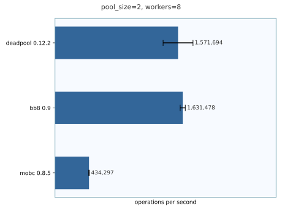
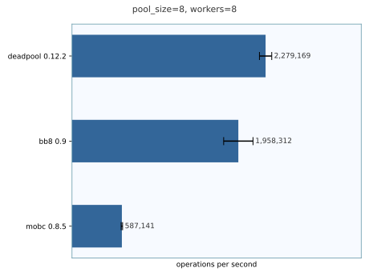
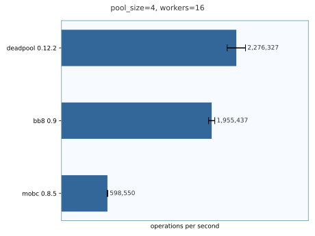
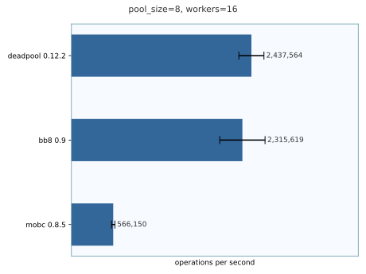
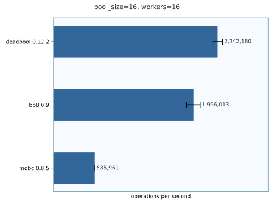
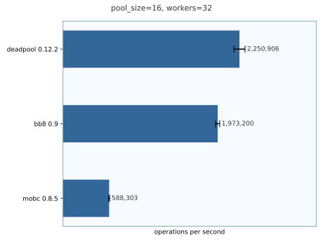
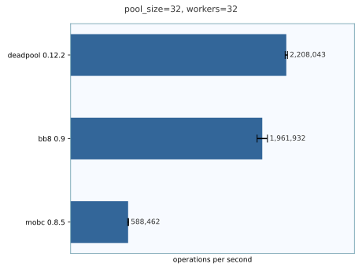

# Benchmark results

> ### ⚠ **Attention!**
>
> The following results include `bb8` and `qp` which
> seam to contain bugs which can cause deadlocks. This benchmark does
> not trigger those bugs but another one created by
> [Astro36](https://github.com/Astro36) does:
> [rust-pool-benchmark#1](https://github.com/Astro36/rust-pool-benchmark/issues/1)

## System details

```
❯ lscpu |grep -e "^CPU(s):" -e "^Model name:"
CPU(s): 4
Model name: Intel(R) Core(TM) i5-7400T CPU @ 2.40GHz
```

```
❯ cat /proc/meminfo | grep MemTotal
MemTotal: 7990808 kB
```

```
❯ lsb_release -a | grep Description
Description: Fedora Linux 41 (Workstation Edition)
```

### 8 Workers





### 16 Workers





### 32 Workers




